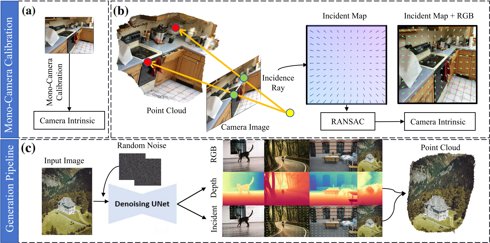
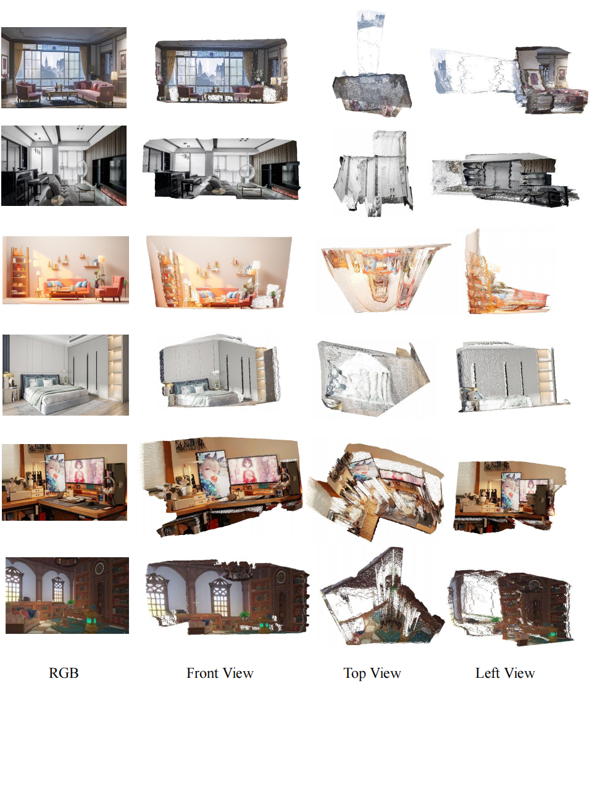
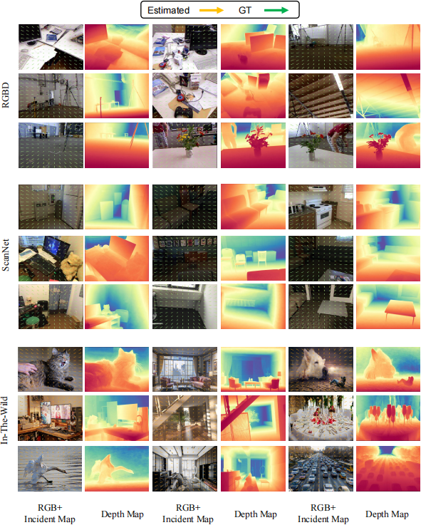

<div align="center">

<h1> DiffCalib: Reformulating Monocular Camera Calibration as Diffusion-Based Dense Incident Map Generation </h1>


### [arXiv](https://arxiv.org/abs/2405.15619)

#### 🔥 Fine-tune diffusion models for camera intrinsic estimation and depth estimation simultaneously! ✈️

</div>

<div align="center">

</div>


##  📢 News
- 2024.7.25:  Release inference code and checkpoint weight of Diffcalib in the repo.
- 2024.7.25: Release [arXiv paper](https://arxiv.org/abs/2405.15619), with supplementary material.


##  🖥️ Dependencies

```bash
conda create -n diffcalib python=3.10
conda activate diffcalib
pip install -r requirements.txt
pip install -e .
```

## Data

Download the intrinsic data from [MonoCalib](https://github.com/ShngJZ/WildCamera/blob/main/asset/download_wildcamera_dataset.sh)

## 🚀 Evaluation
First, Download the [stable-diffusion-2-1](download_stable-diffusion-2-1.py) and transform it to the 8 inchannels from [modify](load_ckpt_and_modify_8in.py) which will be put in --checkpoint, put the checkpoints under ```./checkpoint/```

Then, Download the pre-trained models ```diffcalib-best.zip``` from [BaiduNetDisk](https://pan.baidu.com/s/1jy2jXHoe8IUtOUH_5mfw3g?pwd=xn5p)(Extract code：xn5p). Please unzip the package and put the checkpoints under ```./checkpoint/``` which will be put in --unet_ckpt_path.

finally, you can run the bash to evaluate our model in the benchmark.
```bash
sh scripts/run_incidence_mutidata.sh
```

## 🚀 visualization and 3D reconstruction
For depth and incident map visualization
, download shift model from [res101](https://pan.baidu.com/s/1o2oVMiLRu770Fdpa65Pdbw?pwd=g3yi) (Extract code: g3yi), ```diffcalib-pcd.zip``` from [BaiduNetDisk](https://pan.baidu.com/s/12M2PEqqExGM9vKtMF2mHYg?pwd=4sy1)(Extract code:4sy1) and install torchsparse packages as follows
```bash
sudo apt-get install libsparsehash-dev
pip install --upgrade git+https://github.com/mit-han-lab/torchsparse.git@v1.2.0
```
Then we can reconstruct 3D shape from a single image.
```bash
bash scripts/run_incidence_depth_pcd.sh
```

## 📖 Recommanded Works

- Marigold: Repurposing Diffusion-Based Image Generators for Monocular Depth Estimation. [arXiv](https://github.com/prs-eth/marigold), [GitHub](https://github.com/prs-eth/marigold).

## 🏅 Results in Paper

### point cloud

<div align="center">

</div>

### depth and incident map visualization

<div align="center">

</div>


## 🎓 Citation
```
@article{he2024diffcalib,
  title   = {DiffCalib: Reformulating Monocular Camera Calibration as Diffusion-Based Dense Incident Map Generation},
  author  = {Xiankang He and Guangkai Xu and Bo Zhang and Hao Chen and Ying Cui and Dongyan Guo},
  year    = {2024},
  journal = {arXiv preprint arXiv: 2405.15619}
}
```
